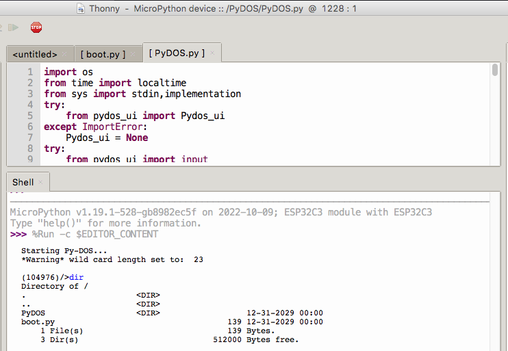
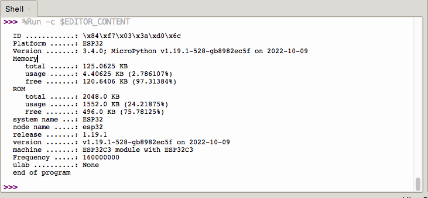

# ESP32C3-micropython-build
building ESP32C3 micropython notes
  

Clone esp-idf repository; For ESP32-C3/S2 need V4.3.1+ 
> _git clone -b v4.4 --recursive https://github.com/espressif/esp-idf.git_  
 

After you've cloned and checked out the IDF to the correct version, run the install.sh script: 
> _cd esp-idf_  
> _./install.sh_       # (or install.bat on Windows) 
> _source export.sh_   # (or export.bat on Windows) 

The install.sh step only needs to be done once.  
You will need to source export.sh for every new session. (For environment variables) 
(Or $export ESP_IDF=~/esp_idf $source export.sh) 
 

Clone MicroPython repository... 
> _git clone https://www.github.com/micropython/micropython_  
> _cd micropython/_  
> _make -C mpy-cross/_  
> _cd ports/esp32_ 
> _make submodules_ 
> _make BOARD=GENERIC_C3 -j4_ 
> _cd build-GENERIC_C3_ 

 
This will produce a combined firmware.bin image in the build-GENERIC_C3/ subdirectory 
(this firmware image is made up of: bootloader.bin, partitions.bin and micropython.bin). 

Project build complete. To flash, run this command: 
> _esptool.py --chip esp32c3 --port /dev/cu.wchusbserialfd130 --baud 460800 write_flash -z 0x0 firmware.bin_ 
> 
 Thonny connectted to micropython w/ PyDOS.
 
  
 micropython display hwInfo.
 

 
---
 
See http://docs.micropython.org/en/latest/esp32/quickref.html for a quick reference, 
and http://docs.micropython.org/en/latest/esp32/tutorial/intro.html for a tutorial.
 
 

## Reference  

[General information about the ESP32 port] https://docs.micropython.org/en/latest/esp32/general.html 
[How to build MicroPython for esp32-C3] https://www.jarutex.com/index.php/2022/01/04/9217/ 
[Awesome resources collections] https://github.com/mcauser/awesome-micropython 
[PyDOS] https://github.com/RetiredWizard/PyDOS

